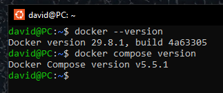
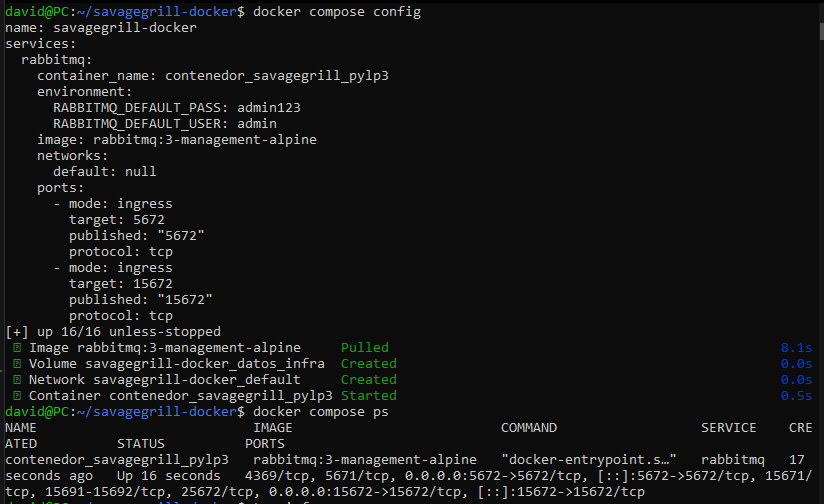
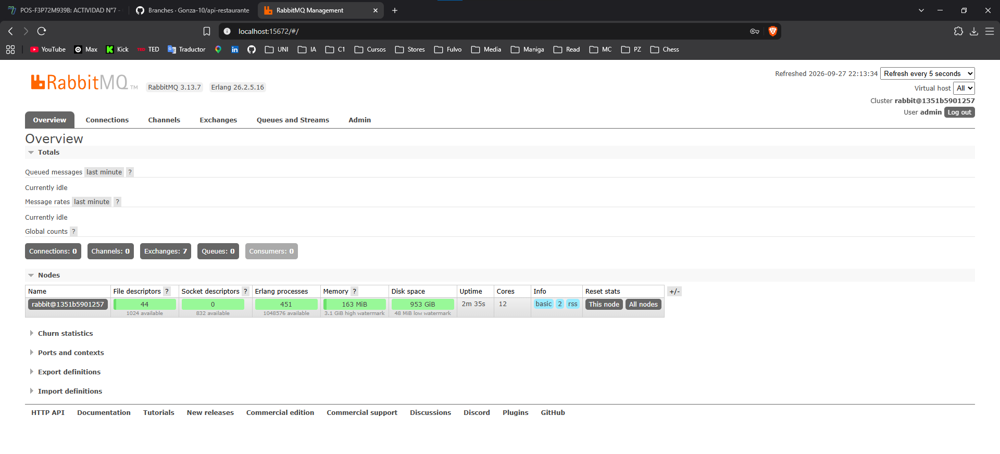

# Docker: contenedores y orquestación

**Institución:** Universidad Cuenca del Plata (UCP) – Sede Posadas
**Asignatura:** Paradigmas y Lenguajes de Programación III
**Equipo:** Noguera David, Viarengo Gonzalo
**Servicio auxiliar elegido:** RabbitMQ (`rabbitmq:3-management-alpine`)

## Fase A: Preguntas clave de investigación

### 1. Contenedor vs. Máquina Virtual

Una máquina virtual emula hardware completo mediante un hipervisor y ejecuta un
sistema operativo invitado entero (kernel, drivers, servicios del SO), y cada VM
reserva su propia RAM y disco desde el arranque. Un contenedor, en cambio, no
tiene sistema operativo propio: es un proceso del sistema anfitrión aislado
mediante *namespaces* (que limitan qué ve el proceso: red, procesos, sistema de
archivos) y *cgroups* (que limitan cuántos recursos puede usar), y comparte el
kernel del host. Por eso consume menos RAM (solo la que usa el servicio, sin un
SO completo detrás) y arranca en segundos: iniciar un contenedor equivale a
iniciar un proceso, no a bootear una máquina. Además, las imágenes se componen
de capas de solo lectura reutilizables, por lo que ocupan menos disco y se
comparten entre contenedores.

### 2. Aislamiento y dependencias

Resuelve el clásico "en mi máquina funciona". Ese problema aparece cuando cada
integrante tiene versiones distintas de runtimes, librerías, drivers o
configuraciones del sistema. Una imagen empaqueta el servicio junto con todo lo
que necesita (binarios, librerías, versión exacta) en un artefacto inmutable, y
el docker-compose.yml describe de forma declarativa cómo se ejecuta. Todos los
integrantes levantan exactamente el mismo entorno con un solo comando, sin
instalar ni configurar nada manualmente en su equipo, y sin que un servicio
interfiera con otro instalado localmente.

### 3. Persistencia y ciclo de vida

Un contenedor escribe en una capa temporal propia. Si se ejecuta `docker rm -f`
sin haber configurado un volumen, esa capa se destruye junto con el contenedor y
**todos los datos se pierden definitivamente**. Un volumen es un espacio de
almacenamiento gestionado por Docker que vive fuera del ciclo de vida del
contenedor y se monta en una ruta interna (por ejemplo `/var/lib/rabbitmq`).
Como los datos se escriben en el volumen y no en la capa del contenedor, al
destruir o reiniciar el contenedor el volumen permanece intacto, y cualquier
contenedor nuevo que lo monte encuentra la información. Solo se elimina si se
lo borra explícitamente (`docker compose down -v` o `docker volume rm`).

### 4. Mapeo de puertos

La sintaxis es `"PUERTO_HOST:PUERTO_CONTENEDOR"`.

- **Izquierda:** puerto de la máquina anfitrión (nuestra PC), por donde nos
  conectamos desde afuera.
- **Derecha:** puerto dentro del contenedor, donde el servicio realmente escucha.

En `"8080:80"`, lo que llegue al puerto 8080 de nuestra máquina se redirige al
puerto 80 del contenedor. En `"5672:5672"` ambos coinciden. Es necesario porque
cada contenedor tiene su propia red aislada: sin publicar el puerto, el servicio
no es accesible desde el host. Además permite evitar conflictos (por ejemplo,
`"5673:5672"` si el 5672 ya está ocupado en el host).

## Fase B: Evidencia de laboratorio

### Nota sobre el entorno de ejecución

La máquina de desarrollo utiliza Windows 10 IoT Enterprise LTSC 21H2 (compilación
19044), versión que el instalador de Docker Desktop no admite. Por ese motivo se
utilizó **Docker Engine instalado sobre WSL 2 (Ubuntu)**, que provee el mismo
motor y el mismo plugin `docker compose`.

### B.1 Verificación del CLI



```
Docker version 29.8.1, build 4a63305
Docker Compose version v5.5.1
```

### B.2 docker-compose.yml



El archivo funcional se encuentra en la raíz del repositorio. Levanta RabbitMQ con
el panel de administración, expone los puertos 5672 (AMQP) y 15672 (panel web) y
persiste los datos en el volumen `datos_infra`.

### B.3 Estado de los contenedores

```
NAME                           IMAGE                          COMMAND                  SERVICE    CREATED          STATUS          PORTS
contenedor_savagegrill_pylp3   rabbitmq:3-management-alpine   "docker-entrypoint.s…"   rabbitmq   17 seconds ago   Up 16 seconds   4369/tcp, 5671/tcp, 0.0.0.0:5672->5672/tcp, [::]:5672->5672/tcp, 15671/tcp, 15691-15692/tcp, 25672/tcp, 0.0.0.0:15672->15672/tcp, [::]:15672->15672/tcp
```

### B.4 Prueba de acceso



*Panel accesible en http://localhost:15672 con el usuario configurado.*
